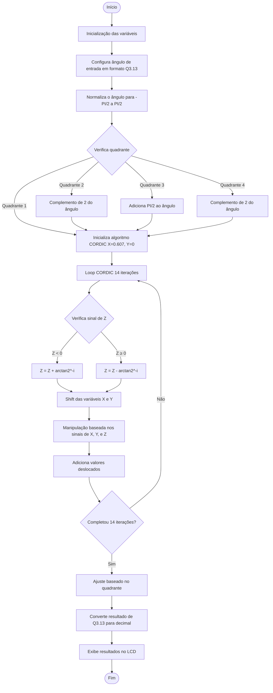

# 📐 CORDIC para 8051 - Cálculo de Seno e Cosseno

Este projeto implementa o algoritmo CORDIC (Coordinate Rotation Digital Computer) em Assembly para microcontroladores 8051, baseado no documento NISTIR 4480 - **Assembly Code to Compute Sine and Cosine Using the CORDIC Algorithm**.

## 🚀 Objetivo
O código calcula os valores de seno e cosseno para um ângulo fornecido em formato fixo Q3.13 (16 bits). É ideal para sistemas embarcados sem hardware de ponto flutuante.

## 📊 Formato dos Dados
O ângulo de entrada (ANGLE0, ANGLE1) deve estar entre 0 e 2π em formato Q3.13.

Exemplo:  
- 0.0 rad → 0x0000  
- π rad → 0x6488

A saída (SEN0:SEN1 e COS0:COS1) também está em Q3.13, com precisão de até 11 bits (~0.0005 de erro).

## 🧠 Como Funciona

### Inicialização:
- X começa com a constante de escala K ≈ 0.6072 → `X = 0x1362`
- Y = 0
- Z recebe o valor do ângulo (após possível ajuste de quadrante)

### Redução de domínio:
- O algoritmo ajusta o ângulo para o intervalo [0, π/2].
- Detecta o quadrante do ângulo e inverte os sinais de X e Y se necessário.

### Iterações (CORDIC_LOOP):
- Executa 14 rotações (deslocamentos e somas/subtrações).
- Aproxima os valores de seno e cosseno usando apenas somas, subtrações e shifts (sem multiplicações).

### Correção de sinal:
- Com base no quadrante original, aplica complemento de dois em X ou Y se necessário.

### Resultado final:
- X contém o cosseno.
- Y contém o seno.
- Gravados nos registradores COS0:COS1 e SEN0:SEN1.

## 🧪 Exemplo de Teste
Para testar o cálculo com ângulo zero, inicialize:

```asm
MOV ANGLE0, #00H
MOV ANGLE1, #00H
```
Resultado esperado:
- COS1:COS0 ≈ 0x2000 (cos(0) = 1.0)
- SEN1:SEN0 ≈ 0x0000 (sen(0) = 0.0)

## 🛠️ Compilação e Simulação
O código foi escrito para uso no simulador EdSim51

## 👷‍♂️ Diagrama de Blocos


## 📚 Referência
- Horst, J. A. (1990). Assembly Code to Compute Sine and Cosine Using the CORDIC Algorithm. NISTIR 4480. PDF